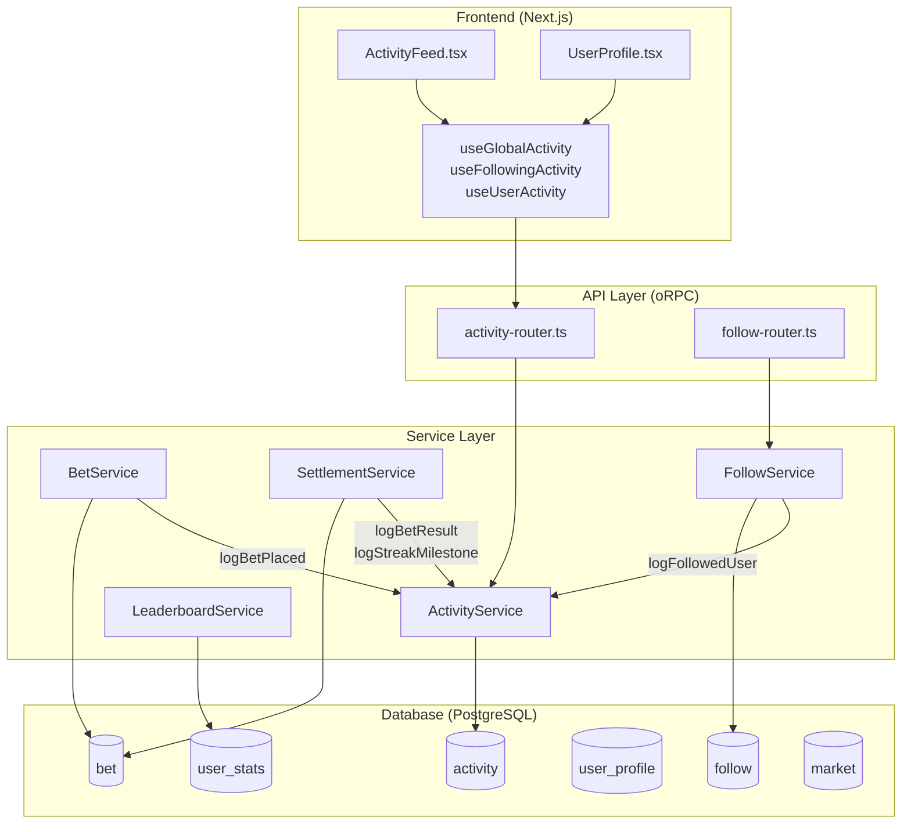
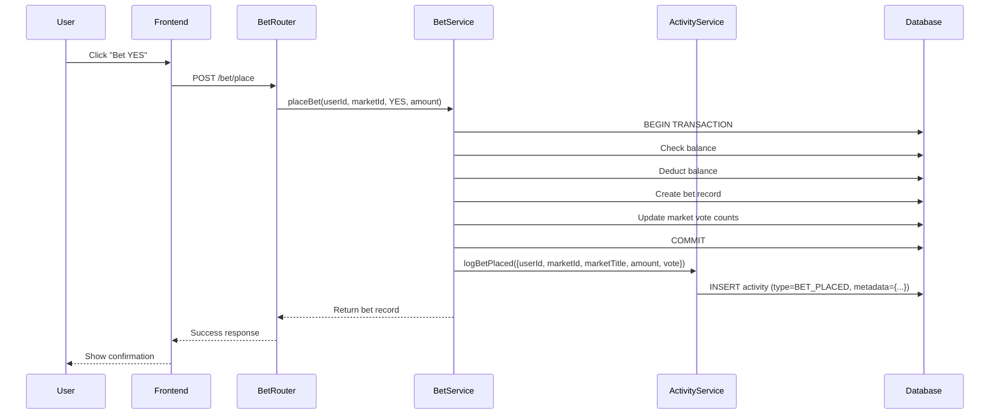
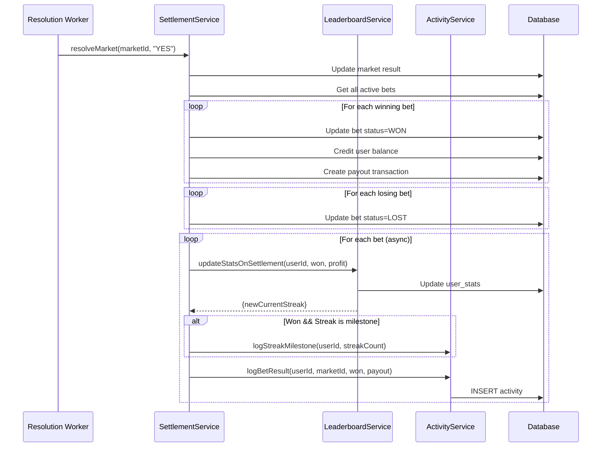
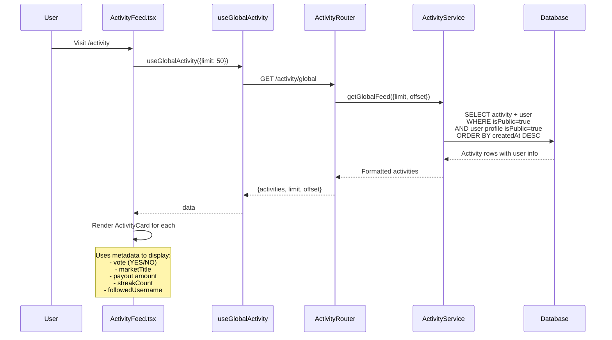

# Activity & Social System Overview

## System Architecture



## Data Flow: Bet Placement



## Data Flow: Market Settlement



## Data Flow: Activity Feed



## Activity Types & Metadata Usage

| Type | Metadata Fields Used | Where Displayed |
|------|---------------------|-----------------|
| `BET_PLACED` | `vote`, `marketTitle`, `amount` | "bet YES on 'Will X happen?'" |
| `BET_WON` | `payout`, `marketTitle` | "won $50.00 on 'Will X happen?'" |
| `BET_LOST` | `marketTitle` | "lost on 'Will X happen?'" |
| `STREAK_MILESTONE` | `streakCount` | "reached a 10 win streak" |
| `FOLLOWED_USER` | `followedUsername`, `followedUserId` | "started following @username" |
| `LEADERBOARD_RANK` | `rank`, `period` | (not implemented in UI yet) |
| `PROFILE_UPDATED` | (none) | (not implemented yet) |

## Current Schema: JSONB Metadata

```sql
CREATE TABLE activity (
    id UUID PRIMARY KEY,
    user_id UUID REFERENCES user(id),
    type activity_type NOT NULL,
    metadata JSONB,  -- <-- All context here
    is_public BOOLEAN DEFAULT true,
    created_at TIMESTAMPTZ,
    updated_at TIMESTAMPTZ
);
```

**Current metadata shape (TypeScript):**
```typescript
type ActivityMetadata = {
  marketId?: MarketId;
  marketTitle?: string;
  amount?: string;
  payout?: string;
  vote?: "YES" | "NO";
  result?: "WON" | "LOST";
  streakCount?: number;
  rank?: number;
  period?: "DAILY" | "WEEKLY" | "MONTHLY" | "ALL_TIME";
  followedUserId?: UserId;
  followedUsername?: string;
};
```

## Alternative: Explicit Columns

```sql
CREATE TABLE activity (
    id UUID PRIMARY KEY,
    user_id UUID REFERENCES user(id),
    type activity_type NOT NULL,

    -- Explicit columns instead of JSONB
    market_id UUID REFERENCES market(id),
    market_title TEXT,
    amount NUMERIC(12,2),
    payout NUMERIC(12,2),
    vote TEXT CHECK (vote IN ('YES', 'NO')),
    result TEXT CHECK (result IN ('WON', 'LOST')),
    streak_count INTEGER,
    rank INTEGER,
    period leaderboard_period,
    followed_user_id UUID REFERENCES user(id),
    followed_username TEXT,

    is_public BOOLEAN DEFAULT true,
    created_at TIMESTAMPTZ,
    updated_at TIMESTAMPTZ
);
```

## Trade-off Analysis

### JSONB (Current)
| Pros | Cons |
|------|------|
| Flexible - add fields without migration | No DB-level type safety |
| Less nullable columns | Can't index individual fields |
| Easy to evolve | No FK constraints on marketId, followedUserId |
| Single schema for all types | Frontend does unsafe `as` casts |

### Explicit Columns (Alternative)
| Pros | Cons |
|------|------|
| DB-level type safety | Many nullable columns |
| FK constraints possible | Schema migration for new fields |
| Can index specific columns | Wider table |
| Cleaner queries | More rigid structure |

### Recommendation

**Keep JSONB** because:

1. **Controlled write path** - All writes go through `ActivityService` methods (`logBetPlaced`, `logBetResult`, etc.) which enforce shape
2. **TypeScript types exist** - Schema is defined in `social.db.ts:194-206`
3. **Read-only in frontend** - Metadata is never mutated client-side
4. **No user input** - Metadata comes from trusted service layer, not user input
5. **Query patterns** - Always fetch full activity, never filter by metadata fields
6. **FK not needed** - We store `marketTitle` as denormalized string, don't need to join

**If you want stricter validation**, add Zod parsing in `getGlobalFeed`/`getFollowingFeed` return, not on write (since writes are already typed).

## Files Reference

| File | Purpose |
|------|---------|
| `packages/db/src/schema/social/social.db.ts` | DB schema definition |
| `packages/api/src/services/activity-service.ts` | Activity CRUD + typed log methods |
| `packages/api/src/services/bet-service.ts` | Calls `logBetPlaced` |
| `packages/api/src/services/settlement-service.ts` | Calls `logBetResult`, `logStreakMilestone` |
| `packages/api/src/routers/activity-router.ts` | oRPC endpoints |
| `apps/web/src/hooks/use-activity.ts` | React Query hooks |
| `apps/web/src/app/activity/activity-feed.tsx` | Feed UI component |
