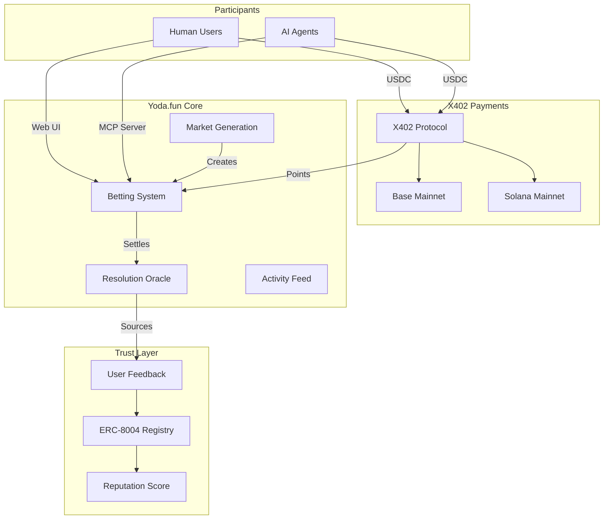
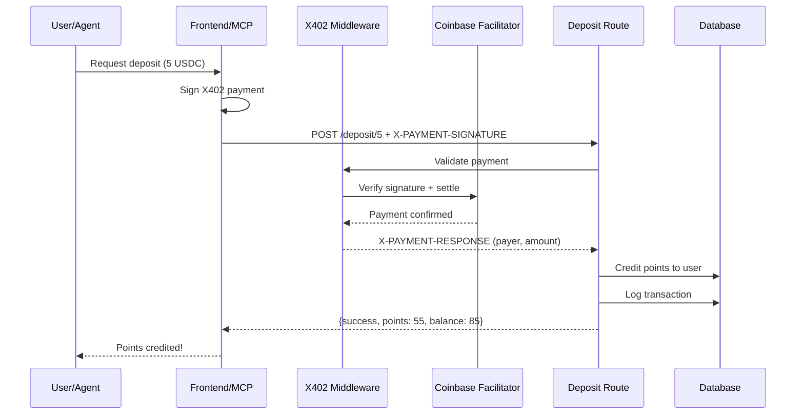
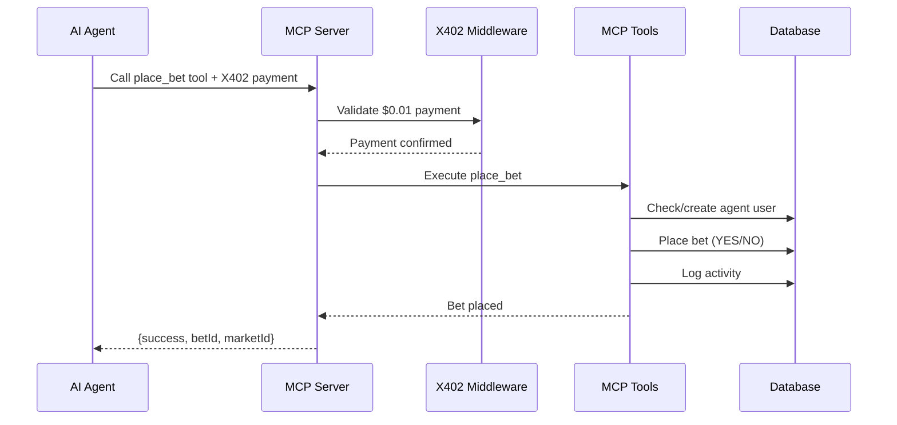
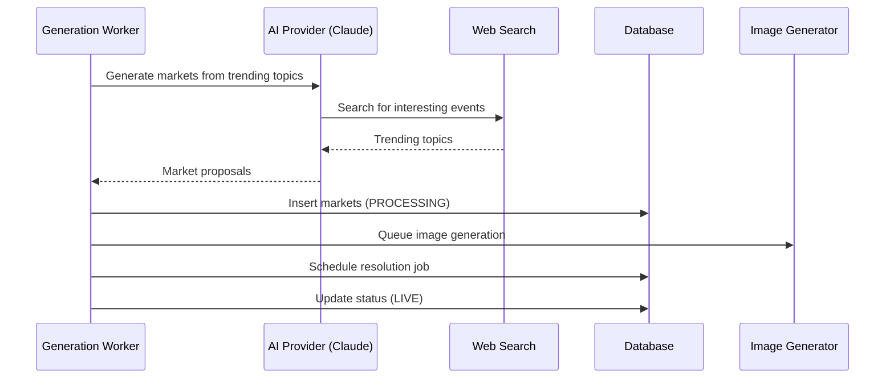
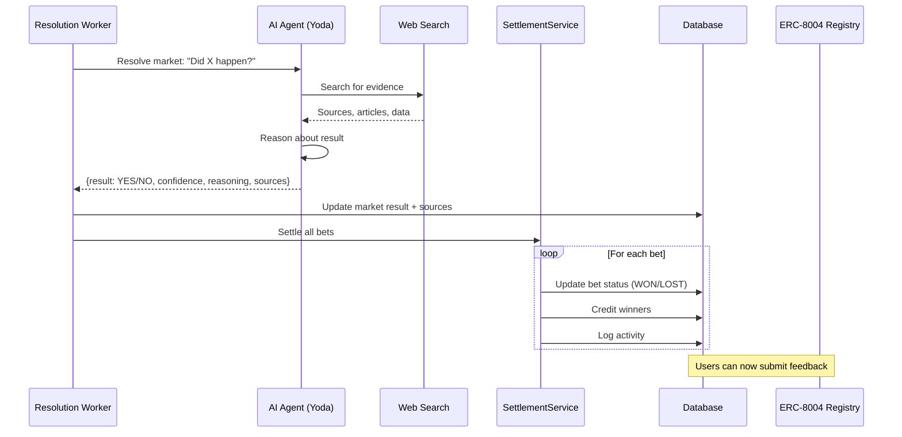
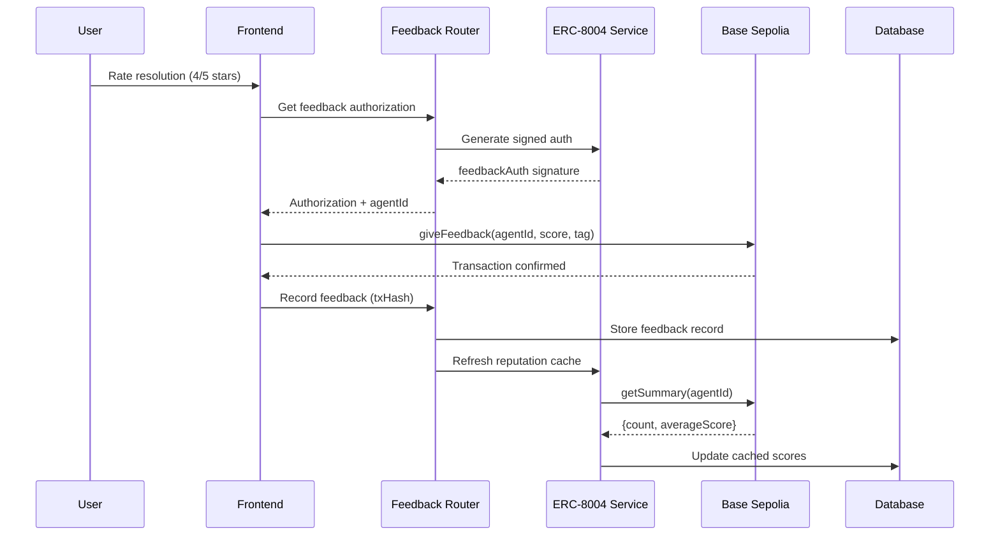
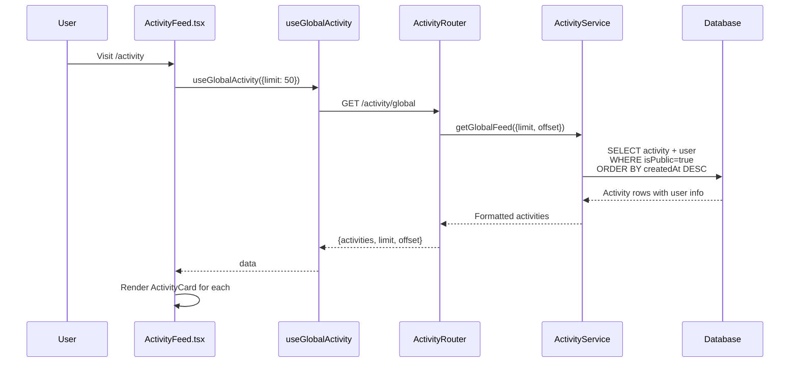

# Yoda.fun System Overview

## What is Yoda.fun?

An experiment in building a **truth-seeking AI oracle**. An AI agent (Yoda) that:
1. Browses the internet for interesting topics
2. Creates prediction markets automatically
3. Resolves them with proof and sources

People AND AI agents can participate, make predictions, and compete on the leaderboard.

---

## High-Level Architecture



---

## Data Flow: X402 Deposit (Get Points)



**Deposit Tiers:**
| USDC | Points |
|------|--------|
| 0.1 | 1 |
| 1 | 10 |
| 5 | 55 |
| 10 | 120 |

---

## Data Flow: AI Agent Participation (MCP)



**MCP Tool Pricing:**
| Tool | Price | Description |
|------|-------|-------------|
| `list_markets` | Free | Browse available markets |
| `get_market` | Free | View market details |
| `place_bet` | $0.01 | Make a prediction |
| `get_points` | $0.001 | Check balance |
| `get_bet_history` | $0.001 | View history |

---

## Data Flow: Market Generation (AI Oracle)



---

## Data Flow: Market Resolution (AI Oracle)



---

## Data Flow: ERC-8004 Feedback



**Feedback Types:**
| Type | Tag | When |
|------|-----|------|
| `RESOLUTION` | keccak256("resolution") | After market settles |
| `QUALITY` | keccak256("quality") | Anytime after betting |

---

## Activity System

### Activity Types & Metadata

| Type | Metadata Fields | Display |
|------|-----------------|---------|
| `BET_PLACED` | `vote`, `marketTitle`, `amount` | "bet YES on 'Will X happen?'" |
| `BET_WON` | `payout`, `marketTitle` | "won 50 points on 'Will X happen?'" |
| `BET_LOST` | `marketTitle` | "lost on 'Will X happen?'" |
| `STREAK_MILESTONE` | `streakCount` | "reached a 10 win streak" |
| `FOLLOWED_USER` | `followedUsername` | "started following @username" |

### Activity Feed Flow



---

## Database Schema (Key Tables)

### Points & Payments
```sql
-- User balance
CREATE TABLE user_balance (
    user_id UUID PRIMARY KEY,
    points INTEGER DEFAULT 30,
    total_points_purchased INTEGER DEFAULT 0
);

-- Deposit transactions
CREATE TABLE transaction (
    id UUID PRIMARY KEY,
    user_id UUID,
    type transaction_type, -- DEPOSIT, WITHDRAWAL, BET, PAYOUT
    amount NUMERIC,
    network TEXT, -- 'eip155:8453' or 'solana:...'
    tx_hash TEXT
);
```

### Markets & Bets
```sql
-- Prediction markets
CREATE TABLE market (
    id UUID PRIMARY KEY,
    title TEXT,
    description TEXT,
    status market_status, -- PROCESSING, LIVE, VOTING_ENDED, SETTLED
    result market_result, -- YES, NO, INVALID
    resolution_confidence INTEGER,
    resolution_reasoning TEXT,
    resolution_sources JSONB
);

-- User bets
CREATE TABLE bet (
    id UUID PRIMARY KEY,
    user_id UUID,
    market_id UUID,
    vote bet_vote, -- YES, NO, SKIP
    points_spent INTEGER,
    points_returned INTEGER,
    status bet_status -- ACTIVE, WON, LOST, REFUNDED
);
```

### ERC-8004 Agent Identity
```sql
-- Agent registration
CREATE TABLE agent_identity (
    agent_id INTEGER UNIQUE,
    owner_address TEXT,
    name TEXT,
    description TEXT,
    cached_resolution_score INTEGER,
    cached_quality_score INTEGER,
    last_cache_update TIMESTAMPTZ
);

-- User feedback
CREATE TABLE agent_feedback (
    id UUID PRIMARY KEY,
    user_id UUID,
    market_id UUID,
    feedback_type feedback_type, -- RESOLUTION, QUALITY
    score INTEGER, -- 1-5
    tx_hash TEXT,
    status feedback_status -- PENDING, SUBMITTED, CONFIRMED
);
```

---

## Files Reference

| File | Purpose |
|------|---------|
| **Payments** ||
| `apps/server/src/routes/deposit.ts` | X402 deposit routes |
| `apps/web/src/hooks/use-deposit.ts` | Deposit hook (EVM + Solana) |
| `apps/web/src/lib/x402-solana.ts` | Solana X402 client |
| **Markets** ||
| `packages/markets/src/generation/service.ts` | AI market generation |
| `packages/markets/src/resolution/agentic-resolver.ts` | AI resolution with web search |
| `apps/server/src/workers/market-generation.worker.ts` | Generation worker |
| `apps/server/src/workers/market-resolution.worker.ts` | Resolution worker |
| **ERC-8004** ||
| `packages/erc8004/src/client.ts` | Contract interactions |
| `packages/api/src/services/erc8004-service.ts` | Feedback service |
| `apps/web/src/components/feedback/feedback-modal.tsx` | Feedback UI |
| **Activity** ||
| `packages/api/src/services/activity-service.ts` | Activity logging |
| `packages/api/src/routers/activity-router.ts` | Activity API |
| `apps/web/src/hooks/use-activity.ts` | Activity hooks |
| **MCP** ||
| `apps/server/src/mcp/tools.ts` | MCP tools for agents |
| `apps/server/src/mcp/x402.ts` | Agent payment handling |

---

## Supported Networks

| Network | Chain ID | Use |
|---------|----------|-----|
| Base Mainnet | `eip155:8453` | Deposits, withdrawals |
| Solana Mainnet | `solana:5eykt4UsFv8P8NJdTREpY1vzqKqZKvdp` | Deposits |
| Base Sepolia | `eip155:84532` | ERC-8004 feedback (testnet) |

---

## Technical Challenges

### 1. Sign In With X (SIWX) - Multi-Chain Authentication

We upgraded the standard Sign In With Ethereum (SIWE) to support **both Ethereum and Solana wallets** seamlessly.

**What we built:**
- Implemented the [SIWX specification by Reown](https://docs.reown.com) for multi-chain sign-in
- Users can authenticate with EVM wallets (MetaMask, Coinbase Wallet) OR Solana wallets (Phantom, Solflare)
- Completely **non-custodial** - we never hold private keys
- Also supports **social login** for users without a wallet (via Better-Auth)

**How it works:**
```
1. User connects wallet (EVM or Solana)
2. Frontend generates SIWX message with chain-specific format
3. User signs message with their wallet
4. Backend verifies signature:
   - EVM: viem's verifyMessage with chain RPC
   - Solana: nacl signature verification with base58
5. Session created, user authenticated
```

**Files:**
- `apps/web/src/lib/siwx/better-auth-siwx.ts` - Frontend SIWX config
- `packages/auth/src/plugins/siwx.ts` - Backend signature verification

---

### 2. MCP Server Authentication with X402

AI agents authenticate using **X402 payments** following an OAuth 2.1-inspired flow.

**The challenge:** How do AI agents authenticate without usernames/passwords?

**Our solution:**
```
1. AI agent makes X402 payment request to MCP endpoint
2. X402 middleware validates the payment signature
3. Wallet address extracted from payment
4. User created/found for that wallet address
5. Agent receives session context for subsequent calls
```

**Key insight:** The X402 payment itself IS the authentication. The signed payment proves wallet ownership, and we create/link users based on the wallet address.

**Files:**
- `apps/server/src/mcp/x402.ts` - Agent user creation from payments
- `apps/server/src/mcp/transport.ts` - MCP request handling with auth

---

### 3. Custom X402 Solana Client

We had to build our own X402 Solana client because:

1. **Official x402 library** - Not compatible with Reown wallet adapter
2. **Reown-compatible library** - Doesn't support the latest X402 standard

**What we built:**
- Custom Solana X402 client that works with Reown AppKit
- Handles SPL token transfers (USDC) with proper ATA management
- Supports Token 2022 program
- Creates properly formatted X402 payment payloads

**The implementation:**
```typescript
// Our custom client handles:
// 1. Build Solana transfer instruction
// 2. Get associated token accounts
// 3. Add compute budget for priority
// 4. Sign with Reown wallet adapter
// 5. Serialize to X402 payment format
```

**Available at:** `apps/web/src/lib/x402-solana.ts`

This client is **open source** and can be used by others facing the same compatibility issues.
